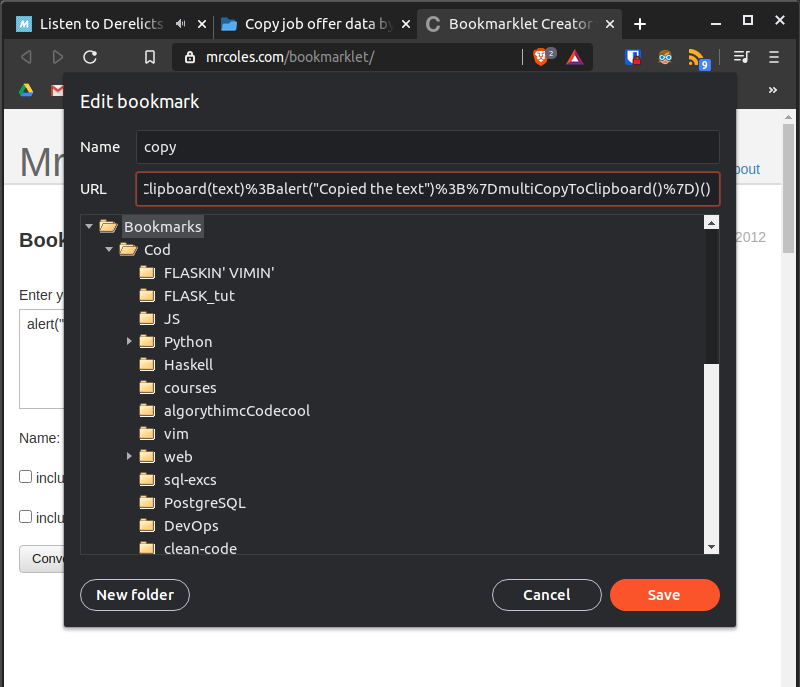

# Job Seek Magic Button  
  
## Table of Contents  
  
1. [Description](#Description)  
2. [Preparation](#Preparation)  
3. [Backlog](#Backlog)  
4. [Contact](#Contact)  
  
## Description  
  
Copy job offer data by one click. The data that this script copies from the job page with the semicolon delimiter is:  
  
- current date  
- job title  
- company name  
- offer link  
  
Output data sample:  
`2021-1-8;Frontend Developer;Grupa Wirtualna Polska;https://www.linkedin.com/jobs/view/2332928981/;`  
  
Tested on Linux Lubuntu 18.04. Works with browsers:  
  
- Chrome  
- Brave  
  
Copying of offers is supported from these pages:  
  
- [linkedin.com](https://www.linkedin.com/)  
- [pracuj.pl](https://www.pracuj.pl/)  
- [praca.pl](https://www.praca.pl/)  
- [indeed.com](https://indeed.com) (works only for job offer pages (not for side view on listed search))
  
Core function copyToClipboard is taken from [here](https://stackoverflow.com/a/33928558/12474392).  
  
## Preparation  
  
1. Copy bookmarklet from from [**here**](bookmarklet/COPYME.md) (converted with [mrcoles.com/bookmarklet/](https://mrcoles.com/bookmarklet/))  
2. Paste result to URL field in your browser bookmark creator  
3. Enjoy :)  
  
  
  
## Backlog  
  
- 2020-6-30  
  - [**fix**] [LinkedIn] works now if company name is not a link  
  - [**enhancement**] [LinkedIn] cutting url only to the necessary part  
  - [**fix**] [LinkedIn] fixed let / var scoping
- 2020-7-15
  - [**fix**] [Pracuj.pl] fixed taking company name with "O firmie" - now takes only the name
- 2020-9-5  
  - [**enhancement**] [Indeed.com] added indeed.com  
- 2021-1-8  
  - [**fix**] [LinkedIn] updated to new linkedin pages structure  
- 2021-1-11  
  - [**mod**] [Neuvoo] remove support for neuvoo.pl  
  - [**mod**] [Indeed] add indeed to readme  
  
## Contact  
  
Created by [@kMatejak](https://github.com/kMatejak/)  
  